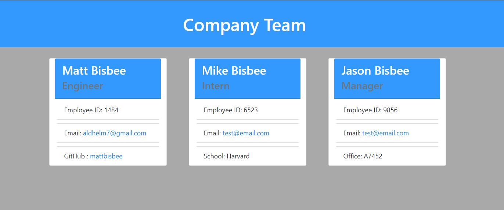

  # Team Profile Generator

  ## **Description**
  A Node.js command-line application that takes in information about employees on a software engineering team and generates an HTML webpage that displays summaries for each person. Also includes tests for each part of the code to help keep the code maintainable.

  ## **Images**
  
  
  ## **Table of Contents**
  
  * [Installation](#dependencies)
  * [Usage](#usage)
  * [Credits](#credits)
  * [License](#license)
  * [Features](#features)
  * [Languages](#languages)
  * [Technology](#technology)
  * [Tests](#tests)
  * [Contribute](#contribute)
  
  ## **Installation**
  npm i, npm i inquirer, npm i jest

  ## **Usage**
  Firstly, 'npm i" should be entered into the terminal. Then 'npm i inquirer' and 'npm i jest'. Once that is done, enter 'node index' into the terminal and it will prompt for all the information it needs. Once you are done, it will generate a new index.html file in the 'dist' folder. Open it into a browser to see your information displayed.

  ## **Credits**
  

  ## **License**
  
   
  
   

  ## **Features**
  https://drive.google.com/file/d/10U5AHvue-WJOVVsL6C2HtIzRuUGO87H7/view

  ## **Languages**
   CSS, HTML, JavaScript, Inquirer, Node JS

  ## **Technology**
  https://jestjs.io/

  ## **Tests**
  npm run test

  ## **Contribute**
  Find me on [GitHub](https://www.github.com/mattbisbee)
   
  Send me an [Email](mailto:aldhelm7@gmail.com)
   
  [Contributor Covenant](https://www.contributor-covenant.org/)
